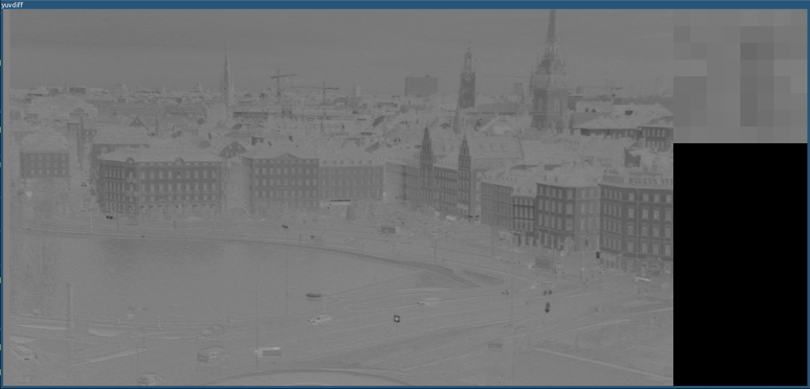

yuvdiff
========

1. Description
-----------

This is a simple tool that does visual diff between two raw 4:2:0 YUV (IYUV)
files. It can also be used as a simple YUV player.

Screenshots
-----------

2. Features
-----------
  * Can view the channels and their diffs separately
  * Zoomed view of the selected 16x16 macroblock
  * Macroblock grid display
  * Frame stepping

3. Dependencies
-----------
libsdl2-dev is required for the sdl2 crate

4. Building
-----------
	cargo build --release

5. Usage
-----------

	yuvdiff [OPTIONS] <FILEA> <FILEB> --width <WIDTH> --height <HEIGHT>

	OPTIONS:
		-c, --channel <CHANNEL>          Channel (y, u, v, c)
		-h, --height <HEIGHT>            Height
		-m, --multiplier <MULTIPLIER>    Diff multiplier (default: 5)
		-v, --view <VIEW>                View (a, b, d)
		-w, --width <WIDTH>              Width

6. Controls
-----------
y, u, v, c -> Switch between Y U V indivudual channels and RGB view

a, b, d -> Switch between Frame A, Frame B and Diff

n, p -> Next frame, Previous frame

g -> Toggle macroblock grid

r -> Reset to first frame

q -> quit

7. Issues
-----------
  1. Dimensions need to be multiples of 4
