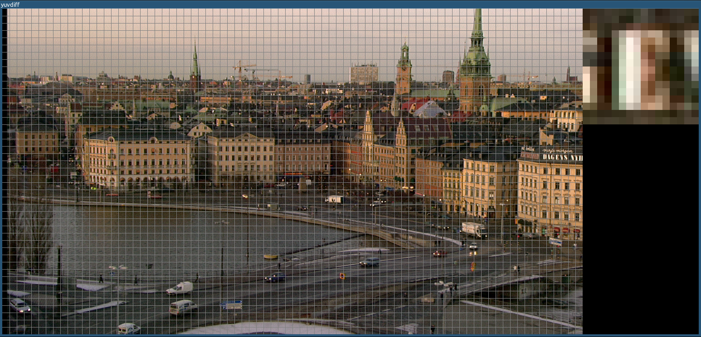
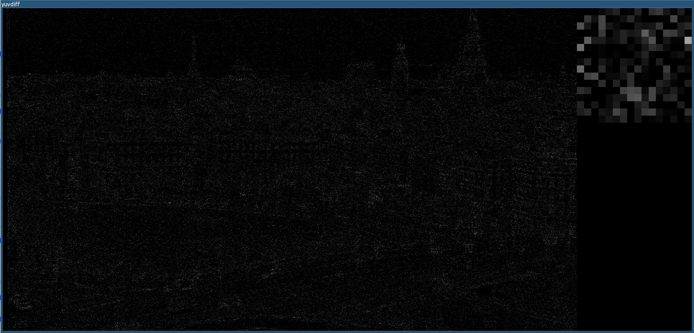

yuvdiff
========

1. Description 
-----------

This is a simple tool that does visual diff between two raw 4:2:0 YUV files. It can also be used as a simple YUV player. 

I wrote this back when I was working on a H.264 encoder. I needed a tool to view the diffs
between the internally reconstructed frames of the encoder and the frames decoded from the generated H.264 bitstream.

Screenshots
-----------

2. Features
-----------
  * Can view the channels and their diffs separately
  * Zoomed view of the selected 16x16 macroblock
  * Macroblock grid display
  * Frame stepping

3. Dependencies
-----------
SDL1.2, SDL_ttf and SDL_gfx 

4. Usage
-----------
`yuvdiff <yuv file a> <yuv file b> <width> <height>`

5. Issues
-----------
  1. Bad code structure in general
  2. Black pixels don't replace the previous pixels when the zoomed area is redrawn
  3. Grid lines can be seen in the zoomed macroblock
  4. Getting previous frame when the current frame is the first breaks the output
  5. Horrible UI

6. Additional stuff
-----------
Uses FreeSans font from http://ftp.gnu.org/gnu/freefont/freefont-ttf-20120503.zip
